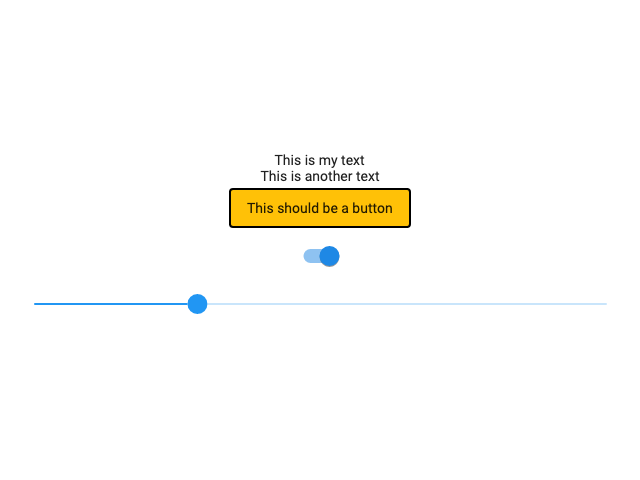

<p align="center">
  
  <h1><b>Showcase</b></h1>
</p>

<!-- Badges -->

[](https://pub.dartlang.org/packages/showcase)
[](https://circleci.com/gh/Igor1201/showcase/tree/master)

**Generate documentation screenshots of your widgets.**

---

## **Installation**
Add the following to your `pubspec.yaml` file:
```yaml
dev_dependencies:
  showcase: <1.0.0
```
then run:
```shell
flutter packages get
```

Then you can either annotate the widgets you want to have showcased or manually create a test file with multiple widgets:

### **With annotations**
Add another dependency to your `pubspec.yaml` file:
```yaml
dev_dependencies:
  build_runner: ^1.2.8
```

Just annotate the widgets you want with `@Showcased`:
```dart
import 'package:showcase/showcase.dart';

@Showcased()
class MyWidget extends StatelessWidget {
  // ...
}
```

The builder will generate a `.showcased_test.dart` test file for each annotated class file. Just run:
```shell
flutter packages pub run build_runner build
```

### **Manually testing**
Create a test file with the following:
```dart
import 'package:flutter_test/flutter_test.dart';
import 'package:showcase/showcase.dart';

void main() {
  group('Showcase!', () {
    showcaseWidgets([]);
  });
}
```

Replace the empty list with a collection of widgets. `showcaseWidgets` also have some options you can tweak.

Then it's just a matter of running `flutter test` and have your screenshots generated on `./showcase/` (or another output directory you had configured).

## **Example showcase**
The example app provided generates the following showcase image:
